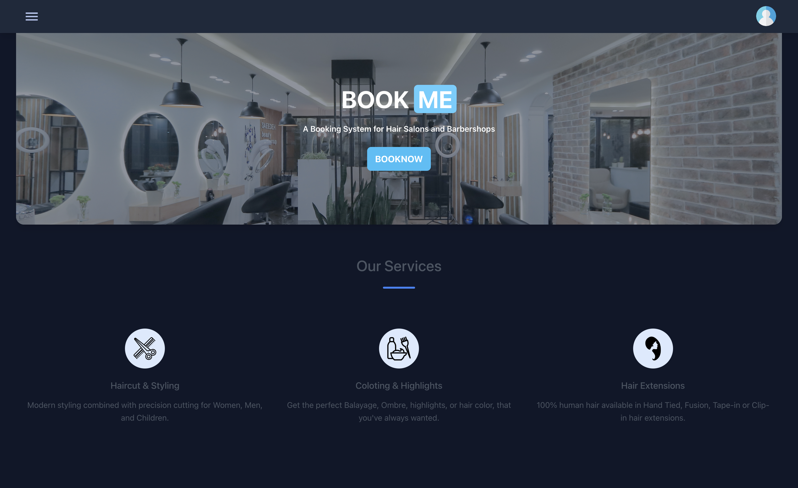
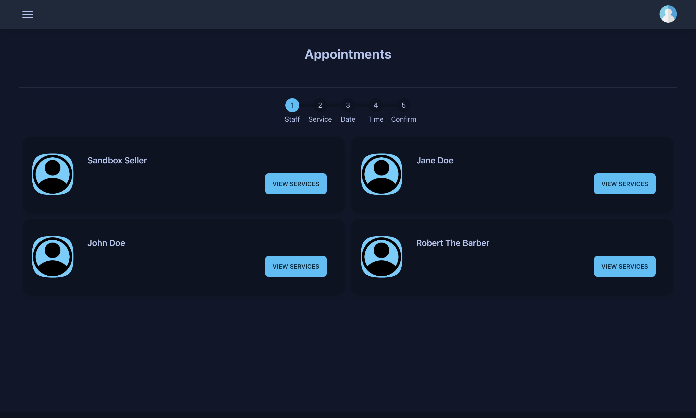
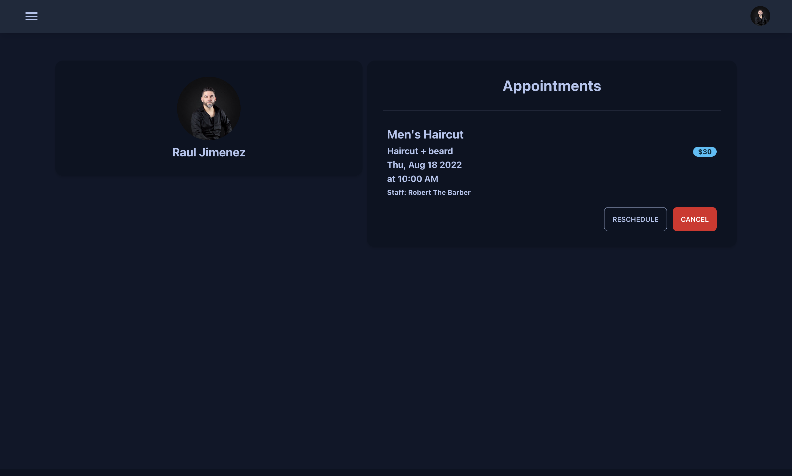

    

<h3 align="center">BookMe</h3>

## Description
BookMe is a web application that give Salon|Barbershop owner the platform they need to bring their business to the next level. The application is designed to give customers the ability to book appointments online and manage their appointments. If customers want to make an appointment as guest, it will require to make a payment with Cashapp pay or credit card. Booking and payment system is powered by Squareup API.

## Deploy on Heroku
[Live Demo](https://desolate-chamber-34231.herokuapp.com/)

## YouTube Video
[YouTube Video](https://youtu.be/y27I4qnjme4)

## Tools Used
- React - [React](https://reactjs.org/)
- TailwindCSS - [TailwindCSS](https://tailwindcss.com/)
- NodeJS - [NodeJS](https://nodejs.org/)
- Express - [Express](https://expressjs.com/)
- Squareup API - [Squareup API](https://developer.squareup.com/reference/square)
- Auth0 - [Auth0](https://auth0.com/)
- Redux - [Redux](https://redux.js.org/)
- DaisyUI - [DaisyUI](https://daisyui.com/)

## Screenshots

## Questions

Contact me by email
Email: [jimenezraul1981@gmail.com](mailto:jimenezraul1981@gmail.com)   
LinkedIn: [LinkedIn](https://www.linkedin.com/in/raul-jimenez-778b2a196/)